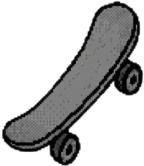

# kaykay

[](https://www.npmjs.com/package/kaykay)
[](https://www.npmjs.com/package/kaykay)
[](LICENSE)

A Svelte 5 flow/node editor library with typed port connections.

## Features

- **Custom Nodes**: Define your own node components
- **Typed Ports**: Custom port types (e.g., `raw`, `processed`) with connection validation
- **Visual Connections**: Bezier curve edges between handles
- **Pan/Zoom**: Navigate large flows with drag/scroll panning and Ctrl/Meta+wheel zoom
- **Drag & Drop**: Add nodes from an external palette at the drop position
- **Selection**: Click to select nodes/edges, Delete to remove
- **History & Clipboard**: Undo/redo plus copy/paste for selected nodes
- **JSON Export**: Get the flow structure as JSON

## Installation

```bash
pnpm add kaykay
```

Package registry: [kaykay on npm](https://www.npmjs.com/package/kaykay)

## Quick Start

Check out the [help page](https://rakunlabs.github.io/kaykay/) for a complete working example!

`MyNode.svelte`

```svelte
<script lang="ts">
  import { Handle, type NodeProps } from 'kaykay';

  let { data }: NodeProps<{ label: string }> = $props();
</script>

<div class="my-node">
  <span>{data.label}</span>
  <Handle id="in" type="input" port="data" position="left" />
  <Handle id="out" type="output" port="data" position="right" />
</div>
```

`+page.svelte`

```svelte
<script lang="ts">
  import { Canvas, type FlowNode } from 'kaykay';
  import MyNode from './MyNode.svelte';

  const nodeTypes = { custom: MyNode };

  const nodes: FlowNode[] = [
    { id: '1', type: 'custom', position: { x: 0, y: 0 }, data: { label: 'Hello' } },
  ];
</script>

<Canvas {nodes} {nodeTypes} />
```

## Drag & Drop Node Creation

Bind the Canvas instance and convert browser drop coordinates into canvas coordinates:

```svelte
<script lang="ts">
  import { Canvas, type FlowNode } from 'kaykay';

  let canvasRef: ReturnType<typeof Canvas> | undefined;

  function handleDrop(event: DragEvent) {
    event.preventDefault();

    const position = canvasRef?.clientToCanvas(event.clientX, event.clientY);
    if (!position) return;

    const node: FlowNode = {
      id: crypto.randomUUID(),
      type: 'custom',
      position,
      data: { label: 'Dropped node' }
    };

    canvasRef?.getFlow().addNode(node);
  }
</script>

<div ondragover={(event) => event.preventDefault()} ondrop={handleDrop}>
  <Canvas bind:this={canvasRef} {nodes} {edges} {nodeTypes} />
</div>
```

### Running the Demo

```bash
pnpm install
pnpm dev
```

Then open http://localhost:5173 to see:
- **Landing page** at `/` with installation and feature overview
- **Interactive playground** at `/playground` with custom nodes and full demo
- **Documentation** with getting started, state/history, styling, and API examples

## Port Types

Handles have a `port` prop that defines what types of connections they accept:

```svelte
<!-- Only connects to handles with port="raw" -->
<Handle id="in" type="input" port="raw" />

<!-- Accepts multiple port types -->
<Handle id="in" type="input" port="data" accept={["raw", "processed"]} />
```

## License

MIT
